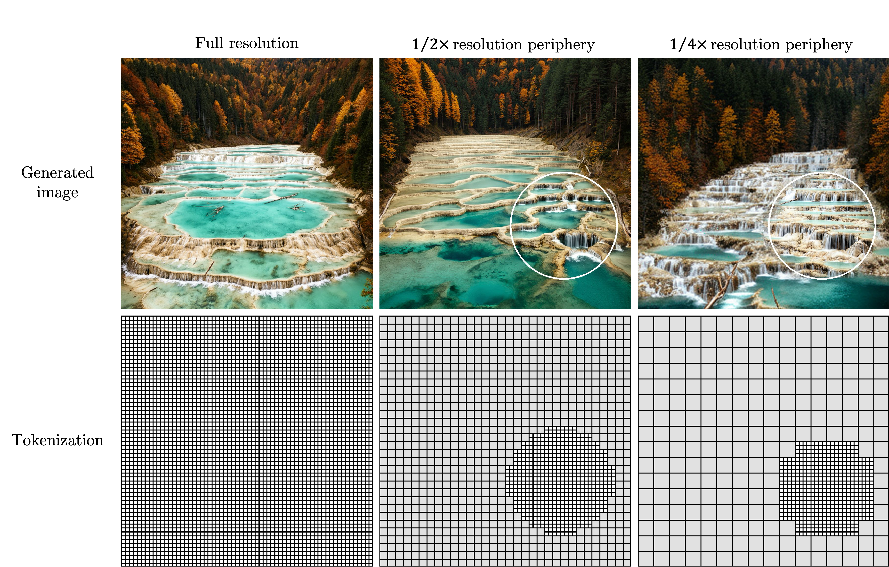

# Foveated Diffusion: Efficient Spatially Aware Image and Video Generation



Code release for [**Foveated Diffusion: Efficient Spatially Aware Image and Video Generation**](https://bchao1.github.io/foveated-diffusion/) — a perceptually motivated, mixed-resolution
diffusion framework that reduces token count during denoising by exploiting the human
visual system's eccentricity-dependent acuity. Built on FLUX.2[klein] (image) and Wan 2.1 (video).

Given a binary foveation mask `M`, high-resolution (HR) tokens are retained inside the
foveal region while peripheral regions are represented at lower resolution (1 LR token
per `lr_factor × lr_factor` HR block), reducing the token sequence to
`L = m + (h·w − m) / lr_factor²`, where `m` is the number of HR tokens.

<div align="center">

🌐 [Website](https://bchao1.github.io/foveated-diffusion/) &nbsp;|&nbsp; 📄 [arXiv](https://arxiv.org/abs/2603.23491) &nbsp;|&nbsp; 🤗 [Model Weights](https://huggingface.co/bchao1/foveated-diffusion) &nbsp;|&nbsp; 🚀 [Demo](https://huggingface.co/spaces/bchao1/foveated-diffusion)

</div>

## Repository layout

```
release/
├── train.py                       Training entry point (image / video)
├── inference.py                   Inference entry point (image / video)
├── requirements.txt
├── configs/                       Example shell launchers
│   ├── train_lora.sh                           image
│   ├── inference_ours.sh                       image
│   ├── inference_baselines.sh                  image
│   ├── inference_trajectory_grid.sh            image
│   ├── train_video_lora.sh                     video training
│   └── inference_video.sh                      video inference
└── src/
    ├── masks/                    Where (centers, radii) come from + how they assemble into a FoveationState
    │   ├── shapes.py              image: single-mask primitives (circle, square, polygons, multi-circle)
    │   ├── trajectories.py        image: sets of static masks for grid experiments
    │   ├── paths.py               video: procedural sources — sample_random_path, sample_spline_path
    │   ├── saliency.py            video: data-driven source — DeepGaze IIE (optional dep, lazy import)
    │   └── state.py               video: FoveationState NamedTuple + build_state assembler (turns any
    │                                     (centers, radii) into the pipeline-consumable state)
    ├── training/
    │   ├── module.py              Flux2FoveatedImageTrainingModule        (image)
    │   ├── module_video.py        WanFoveatedVideoTrainingModule          (video)
    │   └── args.py                argparse — --pipeline {image,video} dispatch
    ├── inference/
    │   ├── pipeline_loader.py     load_pipeline (image) + load_video_pipeline
    │   ├── experiments.py         image EXPERIMENTS dispatch
    │   ├── experiments_video.py   video VIDEO_EXPERIMENTS dispatch
    │   ├── visualize.py           token-grid vis, outline, foveation-circle video overlay
    │   └── args.py                argparse — --pipeline {image,video} dispatch
    └── diffsynth_fov/             Foveation-specific additions on top of upstream DiffSynth
        ├── pipeline.py            Flux2FoveatedImagePipeline               (image)
        ├── pipeline_video.py      WanFoveatedVideoPipeline + WanFoveatedInputVideoEmbedder (video)
        ├── dit.py                 Flux2DiTFoveated (CRPA attention)        (image)
        ├── dit_video.py           convert_to_foveated_wan_dit (CRPA self-attn rebind) + model_fn (video)
        ├── loss.py                FoveatedFlowMatchSFTLoss                 (image)
        ├── loss_video.py          FoveatedWanFlowMatchSFTLoss              (video, random_path default)
        ├── logger.py              WandbModelLogger with foveated validation viz (image)
        ├── logger_video.py        WanVideoWandbModelLogger (per-step loss + sample-video validation) (video)
        └── runner.py              launch_training_task with --max_training_steps  (shared)
```

## Installation

This repo depends on [DiffSynth-Studio](https://github.com/modelscope/DiffSynth-Studio).
Foveation-specific components (`Flux2FoveatedImagePipeline`, `Flux2DiTFoveated`,
`WanFoveatedVideoPipeline`, the foveated losses, loggers, and training runners) are
vendored under `src/diffsynth_fov/` and import upstream diffsynth for everything
else (base pipelines / DiTs / VAEs / text encoders, flow-match scheduler,
`UnifiedDataset`, `ModelLogger`, `DiffusionTrainingModule`).

```bash
pip install -r requirements.txt
# Install DiffSynth-Studio per its own instructions, e.g.
#   pip install -e /path/to/DiffSynth-Studio

# Optional: saliency-guided masks (video --foveation_from_video; image --foveated_training_mode saliency)
pip install deepgaze-pytorch
```

Model weights download on first use via Hugging Face / Modelscope:
- Image: `black-forest-labs/FLUX.2-klein-base-4B` (~30 GB)
- Video: `Wan-AI/Wan2.1-T2V-1.3B` (~10 GB)

---

# Image pipeline (FLUX.2 klein)

## Training (image)

LoRA fine-tuning of the foveated FLUX2 DiT with the foveated flow-matching SFT loss:

```bash
bash configs/train_lora.sh
```

Key arguments (see `src/training/args.py`):

| Arg | Default | Meaning |
|---|---|---|
| `--pipeline` | `image` | — |
| `--task` | `sft` | `sft` (foveated flow-matching SFT) or `direct_distill` |
| `--lora_base_model` | — | DiT module to wrap with LoRA (e.g. `dit`) |
| `--lora_rank` | `32` | LoRA rank |
| `--foveated_training_mode` | `random` | `fixed` / `random` / `saliency` / `bbox` |
| `--lr_downsample_factor` | `2` | LR-periphery downsample factor (2 or 4) |
| `--decode_mode` | `direct` | `direct` (HR only) or `merge` (blend HR + LR decoded latents) |

## Inference (image)

Select an experiment via `--experiment`:

| Experiment | Description |
|---|---|
| `high_res` | Full-resolution baseline. **No foveation mask** — runs with `decode_mode="direct"` so every token is HR. |
| `naive_mixed_res` | Mixed-resolution with naive bilinear/nearest up/down (no learned model). Uses the **default eval mask**: a single centered region (shape `--full_eval_mask`, default `square`; radius `--mask_radius`, default `0.5`) at image center `(0, 0)`, shared across all prompts. |
| `ours` | Our method: foveated flow matching with LoRA. Uses the **same default eval mask as `naive_mixed_res`** (same shape, radius, and center) so the two are directly comparable. |
| `circular_traj` | Single prompt, mask center orbits over `--num_frames` steps. |
| `vary_radius` | Single prompt, sweeps foveation radius from 0.1 to 1.0. |
| `runtime` | Runtime benchmark across HR-token counts. |
| `foveation_trajectory_grid` | N prompts × M masks; trajectory chosen via `--foveation_trajectory_type`. |
| `user_study` | Triplets `(high_res, naive, ours)` per prompt with a **random** circular mask (radius `0.33`, center sampled uniformly from `[-0.3, 0.3]²`). All three triplet members share the same mask and seed. |

Examples:

```bash
# Our method, batched over a prompt CSV
bash configs/inference_ours.sh

# Trajectory grid (spiral) for paper figures
bash configs/inference_trajectory_grid.sh

# Baselines for comparison
bash configs/inference_baselines.sh
```

Key arguments (see `src/inference/args.py`):

| Arg | Default | Meaning |
|---|---|---|
| `--pipeline` | `image` | — |
| `--experiment` | `ours` | Which experiment to run (see table above) |
| `--model_id` | `black-forest-labs/FLUX.2-klein-base-4B` | HuggingFace model ID for the base DiT |
| `--lora_checkpoint` | `None` | Path to a LoRA `.safetensors`; takes precedence over `--lora_mode` |
| `--lora_mode` | `None` | Auto-download a pre-trained image LoRA: `random` (`fov_random`), `saliency` (`fov_saliency`), or `bbox` (`fov_bbox`) from `bchao1/foveated-diffusion` |
| `--dit_checkpoint` | `None` | Path to a full DiT checkpoint (replaces base weights entirely) |
| `--prompt` | built-in dog prompt | Generation prompt |
| `--height` / `--width` | `1024` | Output image resolution |
| `--num_inference_steps` | `50` | Number of denoising steps |
| `--guidance_scale` | `4.0` | CFG guidance scale |
| `--seed` | `0` | RNG seed |
| `--decode_mode` | `direct` | `direct` (HR-only decode) or `merge` (blend HR + LR decoded latents) |
| `--lr_downsample_factor` | `2` | LR-periphery spatial downsampling factor (`2` = 4× fewer tokens, `4` = 16×) |
| `--soft_foveation_blend` | `False` | Gaussian-falloff mask boundary in `merge` decode mode |
| `--mask_radius` | `0.30` | Foveation radius (circular mask) or side half-length ratio (square mask) |
| `--full_eval_mask` | `square` | Eval mask shape: `square`, `checkerboard`, or `circular` |
| `--mask_shape` | `circular` | Mask geometry for trajectory experiments: `circular` or `square` |
| `--output_dir` | `./outputs/flux2_foveated` | Output directory |
| `--full_eval` | off | Run over a full prompt CSV instead of a single `--prompt` |
| `--prompt_dataset_path` | — | Path to CSV with a `prompt` column |
| `--num_prompts` | `None` | Cap the number of prompts read from the CSV |
| `--num_subsets` / `--subset_idx` | `1` / `0` | Distributed eval: total shards / index of this shard |
| `--num_frames` | `81` | Number of mask positions for `circular_traj` / `vary_radius` trajectory experiments |
| `--orbit_radius` | `0.25` | Orbit radius for `circular_traj` |
| `--foveation_trajectory_type` | `circular` | Trajectory type for `foveation_trajectory_grid` (see table below) |
| `--num_cols` | `4` | Columns in the `foveation_trajectory_grid` output montage |
| `--grid_rows` / `--grid_cols` | `3` / `3` | Grid dimensions for `--foveation_trajectory_type grid` |

### Foveation mask trajectories (image)

Used by `foveation_trajectory_grid` (`--foveation_trajectory_type`):

| Value | Description |
|---|---|
| `circular` | Mask center orbits evenly around a circle of radius `--orbit_radius`. |
| `random_circular` | Same orbit, but angles sampled uniformly at random. |
| `radius` | Mask centered at origin; radius swept from 0.3 to 0.7. |
| `grid` | Center steps over an `--grid_rows × --grid_cols` grid. |
| `spiral` | Two-pass spiral: outward + grow, then inward + grow. |
| `polygons` | Cycles through triangle / square / hexagon / star with random center/scale. |
| `multi_circle` | 2–3 non-overlapping circles spread across image quadrants. |

### Distributed evaluation (image)

Shard a large prompt CSV across GPUs by running one process per GPU:

```bash
for i in 0 1 2 3 4 5 6 7; do
  CUDA_VISIBLE_DEVICES=$i python inference.py \
    --pipeline image \
    --experiment ours --full_eval \
    --num_subsets 8 --subset_idx $i \
    --prompt_dataset_path prompts.csv \
    --output_dir outputs/ours_eval &
done
wait
```

---

# Video pipeline (Wan2.1 T2V-1.3B)

## Training (video)

Foveated LoRA fine-tuning of Wan2.1-T2V-1.3B with the foveated flow-matching SFT loss
(region-split MSE: HR loss on the foveal region, LR loss on the periphery):

```bash
bash configs/train_video_lora.sh                                # random_path masks (default)
# saliency-driven training: same config + the --foveation_from_video flag
bash -c 'source configs/train_video_lora.sh --foveation_from_video'
# or just add `--foveation_from_video` to the accelerate launch line.
```

Key arguments (see `src/training/args.py`):

| Arg | Default | Meaning |
|---|---|---|
| `--pipeline` | `image` | Set to `video` |
| `--num_frames` | `81` | Output video length |
| `--foveation_from_video` | off | Use DeepGaze saliency on the input videos. Default sampler when off is `random_path` (paper §4.1) — linear interpolation between sampled endpoints, **not** per-frame independent random. |
| `--max_timestep_boundary` / `--min_timestep_boundary` | `1.0` / `0.0` | Fractional bounds on sampled flow-match timesteps |
| `--use_wandb` | off | Log per-step loss + cadenced sample videos to WandB |
| `--wandb_project` | `foveated-diffusion` | |
| `--save_steps` | (`add_general_config` default) | Cadence of intermediate checkpoint saves |
| `--log_video_steps` | `1000` | Cadence of sample-video validation renders (lands on disk under `{output_path}/samples/`; uploaded to WandB when `--use_wandb` is on). Set to 0 to disable. |
| `--sample_prompt` | canonical Wan demo | Prompt used for the sample-video render |
| `--sample_foveation_trajectory` | `spline` | `spline` (deterministic, recommended for cross-snapshot comparison) or `random_path` (matches training sampler) |
| `--sample_num_inference_steps` | `30` | Denoising steps for sample-video gen (kept smaller than inference's 50 to bound validation cost) |
| `--sample_seed` / `--sample_cfg_scale` | `42` / `5.0` | Fixed across snapshots so progression diffs reflect LoRA change only |

`bash configs/train_video_lora.sh` matches the paper's training config:
480×832, 81 frames, LoRA rank 32 on `q,k,v,o,ffn.0,ffn.2`, gradient checkpointing.

Multi-GPU training uses standard `accelerate launch --multi_gpu --num_processes=N`.

## Inference (video)

```bash
# Default: foveated `ours` with the vendored LoRA + the canonical Wan demo prompt
bash configs/inference_video.sh

# Other experiments
EXPERIMENT=high_res bash configs/inference_video.sh
EXPERIMENT=naive    bash configs/inference_video.sh

# Custom prompt
PROMPT="A majestic eagle soaring over a mountain range at sunrise..." \
  bash configs/inference_video.sh
```

Experiments (`--pipeline video --experiment`):

| Experiment | Description |
|---|---|
| `high_res` | Vanilla Wan T2V baseline; no foveation. |
| `naive` | Spline `FoveationState`, no LoRA. Shows the paper's Fig. 8 failure mode (scale mismatches / duplicates at the HR/LR boundary). |
| `ours` | Spline `FoveationState` + LoRA. The default `--lora_checkpoint` auto-downloads `video/fov_random_path.safetensors` from [bchao1/foveated-diffusion](https://huggingface.co/bchao1/foveated-diffusion) on first use (drop a copy at `checkpoints/wan_random_path_lora.safetensors` to override locally). To use a saliency-trained or bbox-trained LoRA, just point `--lora_checkpoint` at it — the inference code path is identical regardless of how the LoRA was trained. |

Each foveated experiment saves the raw MP4 plus a `_with_circle.mp4` variant where
the per-frame foveation circle is drawn paper-figure-style.

Key arguments (video-specific; see `src/inference/args.py`):

| Arg | Default | Meaning |
|---|---|---|
| `--pipeline` | `image` | Set to `video` |
| `--foveation_trajectory` | `spline` | `spline` (deterministic default keypoints) or `random_path` (matches the training sampler) |
| `--num_frames` | `100` | Set `--num_frames 81` for the paper config (or use the supplied shell config) |
| `--cfg_scale` | `5.0` | Wan default; image-side uses `--guidance_scale` instead |
| `--prompt` | canonical Wan demo when omitted (`DEFAULT_VIDEO_PROMPT`); FLUX2 default for `--pipeline image` | |
| `--lora_checkpoint` | `None` | Path to a LoRA `.safetensors`. Takes precedence over `--lora_mode`. For video `--experiment ours`, falls back to auto-downloading `video/fov_random.safetensors` from HF if neither is set. |
| `--lora_mode` | `None` | Auto-download a pre-trained LoRA from `bchao1/foveated-diffusion`. Image: `random`, `saliency`, `bbox`. Video: `random` only. Ignored when `--lora_checkpoint` is set. |
| `--negative_prompt` | canonical Wan negative when omitted | |
| `--fps` / `--quality` | `15` / `5` | Output MP4 encoding |

---

## Web GUI (image only for v1)

A minimal browser interface for interactively running the foveated FLUX2 pipeline.
Paint a foveation mask (or drag a circle) on a 1024×1024 canvas, watch the
resulting tokenization grid update live, then run a single inference pass.
Generation runs in a background thread with a step-by-step progress bar.

```bash
pip install flask
python webgui/server.py \
    --port 5000 \
    --lora_checkpoint /path/to/lora.safetensors  # optional
```

Then open [http://localhost:5000](http://localhost:5000). See
[webgui/README.md](webgui/README.md) for flags, UI controls, mask
quantization rules, and the fixed pipeline settings baked into the demo.

## Output layout

```
# (image) high_res / naive_mixed_res / ours (full_eval)
output_dir/
  img_0000000000.png            # global prompt index
  ...
  metadata_00000.csv            # one CSV per shard

# (image) foveation_trajectory_grid
output_dir/
  tokenization_masks/tokenization_mask_0000.png
  000/prompt.txt, img_0000.png, mask_0000.png, ...
  001/...

# (image) user_study
output_dir/
  00000/prompt.txt, img_high_res.png, img_naive.png, img_ours.png,
        mask.png, fixation_point.png
  ...

# (image) circular_traj / vary_radius
output_dir/
  img_000.png, foveation_mask_000.png, ...

# (image) runtime
output_dir/
  img_00.png, runtime_and_radius_list.npz

# (video) high_res / naive / ours
output_dir/
  high_res.mp4
  naive.mp4,    naive_with_circle.mp4
  ours.mp4,     ours_with_circle.mp4
```
